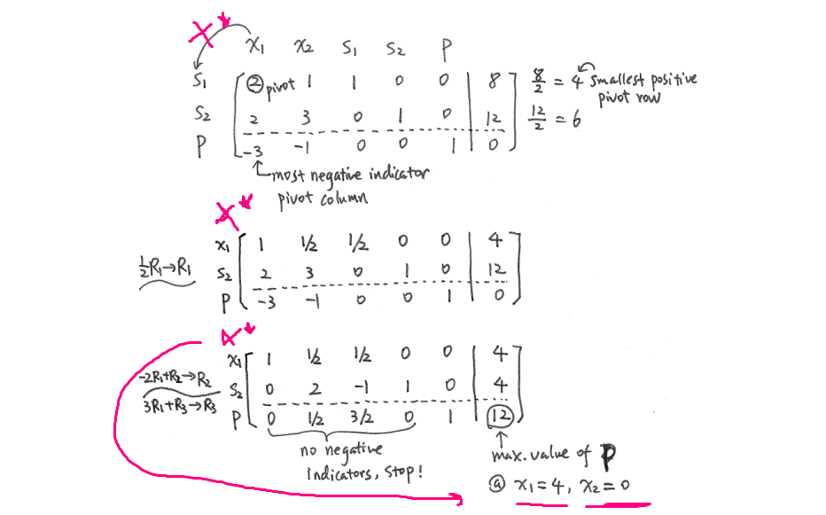

# Simplex method algorithm

Input contains:
1. C -  vector of coefficients of objective function
2. A - matrix of coefficients of constraint function
3. b - vector of right-hand side numbers


The output contains:
* The string ”The method is not applicable!”
<br>or
* A vector of decision variables - x
* Maximum (minimum) value of the objective function.


## STEP 1. Initialization


1.1 Reading data<br>
<br>
-4 -1 -4 0 0 0 1 <br>
2 1 1 1 0 0<br>
1 2 3 0 1 0<br>
2 2 1 0 0 1<br>
2 4 8<br>
<br>
1.2 Create the initial tableau using `setupTableau`
> Combine the objective function coefficients (C), constraint coefficients (A), and right-hand side values (b) to form the initial tableau.

## STEP 2. Check if the method is applicable
[possible answer](https://math.stackexchange.com/questions/1314137/how-to-find-out-whether-a-linear-program-is-infeasible-using-the-simplex-algorit) <br>


$z_1 = c_{b1}*x1 + c_{b2}*x1$ <br>
$z_2 = c_{b1}*x2 + c_{b2}*x2$ <br>
...
$z_i = c_{b1}*xi + c_{b2}*xi$ <br>
$${z_j - c_j < 0 \ after\  the\  last\ iteration\  => no\ solution}$$

## STEP 3. Iterate Until Optimal Solution
### Iteration algorithm
1. Select the most negative value in last row (*pivot column*)
2. selecting *pivot row* by finding min ${b_{i}}/{x_{i}}$ <br>

3. Make if needed pivot element to equal `1`
4. Obtain zeros for all rest entries in pivot column by row operations. <br>

5.  identify entering variable and exit variable at mean time <br>

6. if all values <= 0 => found optimal solution, so exti<br>
otherwise, if we have negative and positive values, then we go to `1` step of algorithm
7. max z value: <br>


### Functions placeholders
```c
// Function to initialize the tableau
void initializeTableau(double **tableau, int numConstraints, int numVariables) {
    // Implementation...
}

// Function to print the tableau
void printTableau(double **tableau, int numRows, int numCols) {
    // Implementation...
}

// Function to find the entering variable
int findEnteringVariable(double *objectiveFunction, int numVariables) {
    // Implementation...
}

// Function to find the leaving variable using the ratio test
int findLeavingVariable(double **tableau, int enteringVariable, int numConstraints) {
    // Implementation...
}

// Function to perform the pivot operation
void performPivot(double **tableau, int enteringVariable, int leavingVariable, int numRows, int numCols) {
    // Implementation...
}

// Function to check for optimality
bool isOptimal(double *objectiveFunction, int numVariables) {
    // Implementation...
}

// Function to perform the simplex method
void simplexMethod(double **tableau, int numConstraints, int numVariables) {
    // Implementation...
}

```
---

reference list: 
* [link1_with_vpn](https://math.libretexts.org/Bookshelves/Applied_Mathematics/Applied_Finite_Mathematics_(Sekhon_and_Bloom)/04%3A_Linear_Programming_The_Simplex_Method/4.02%3A_Maximization_By_The_Simplex_Method)
* [link2](https://optimization.cbe.cornell.edu/index.php?title=Simplex_algorithm)
* [link3](https://www.math.wsu.edu/faculty/dzhang/201/Guideline%20to%20Simplex%20Method.pdf)
